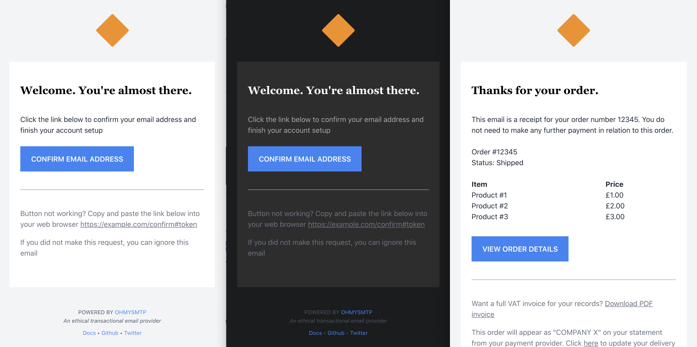

## About

This is a collection of gorgeous HTML transactional email templates, built using [Maizzle](https://maizzle.com/) and [Tailwind CSS](https://tailwindcss.com/).


And yes, they support Dark Mode out of the box :)



## Show me the templates!

- **Welcome** Send a welcome email to users with a call to action [Live Preview](welcome.html)
- **Email Confirmation** Confirm a new email address [Live Preview](confirmation.html)
- **Password Reset** Reset a user's password [Live Preview](password_reset.html)
- **Receipt** Example product receipt email [Live Preview](receipt.html)
- **Security Alert** Example security alert email [Live Preview](security_alert.html)
- **Account Deleted** Notify a user on account deletion [Live Preview](account_deleted.html)

## Using the Templates

Production-ready templates are located in [/dist](./dist). To use them copy them into your application as email templates and modify any variables you want to include as per your application / sending software.

You can use [Maizzle's render method](https://maizzle.com/docs/nodejs/) to integrate with web application frameworks like Rails, Laravel and more.

## Modifying the Templates

While you can modify templates in the `dist/` folder directly, it's not recommended as you lose a lot of the pre-processing benefits. Instead follow these instructions:

1. Clone this repository

2. Install dependencies

   ```sh
   npm i -g @maizzle/cli
   cd templates
   npm install
   ```

3. Start Development

   ```sh
   maizzle serve
   ```

4. Modify the templates

   You can see detailed instructions in the [Maizzle Docs](https://maizzle.com)

5. Build for Production

   ```sh
   maizzle build prod
   ```
   Your modified templates will be available in `./dist/`

## More Documentation

Maizzle documentation is available at https://maizzle.com

## Issues, Fixes & PRs

If you find any issues please open a PR. If you find the templates useful, please contribute back with more templates.


## License

This code is open-source software licensed under the [MIT license](https://opensource.org/licenses/MIT).
